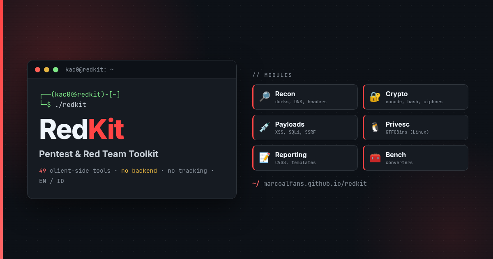

<p align="center">
  
</p>

# RedKit

**Pentest & Red Team Toolkit.** A fast, fully **client-side** collection of 49 offensive-security tools: encoders and decoders, hashes and ciphers, payload libraries, recon helpers, Linux privilege-escalation lookup, and CVSS reporting. No backend, no tracking, everything runs in your browser.

🔗 **Live:** https://marcoalfans.github.io/redkit/

🌐 Bilingual UI (English / Indonesian) with a one-click language toggle, plus a `Cmd/Ctrl + K` tool search.

## Tools

RedKit groups 49 tools into six categories.

### Recon & OSINT
Google and Shodan dork generators, subdomain finder (certificate transparency), JS file analyzer (endpoints and secrets), security header analyzer, DNS lookup over HTTPS, URL parser, IP and domain info, Nmap / curl command builder (with a tooltip on every option), and an HTTP status and port reference.

### Crypto
- **Encoding:** Magic auto-detector (recursively decodes nested layers, with entropy and output-type hints), a Base encoder covering Base16/32/36/45/58/62/64/85/91, plus URL, HTML, Hex (with a hex dump), Binary, Morse, and a PowerShell encoder.
- **Hashing:** hash generator (MD5 through SHA-512), hash identifier, and a JWT decoder and editor.
- **Ciphers:** Caesar / ROT (live brute-force of all 26 rotations with English auto-detection), Vigenère (encrypt, decrypt, and keyless auto-crack), Affine (with brute-force), Atbash, and reverse.

### Payloads & Web Exploitation
CSRF PoC generator, DoS payload generator, reverse shell generator, and curated libraries and helpers for XSS, SQLi, command injection, SSTI, XXE, path traversal / LFI, IDOR, 403 bypass, open redirect, CSRF bypass, SSRF, GraphQL, JWT attacks, and Unicode / homoglyph / punycode.

### Privesc
**GTFOBins (Linux):** search 477 binaries by sudo / SUID / capabilities context with copy-ready commands, or paste your `sudo -l`, SUID `find`, or `getcap` output and let it flag what is exploitable.

### Reporting
CVSS 3.1 and 4.0 calculators and a vulnerability report template.

### Bench
Timestamp converter, chmod calculator, and an identifier notation converter.

## Stack

Vanilla JavaScript, no build step, deployable as a static site (GitHub Pages).

```
index.html                 entry + <script> load order
assets/                    styles.css, favicon.svg, og-card.png
js/
  core.js                  helpers + UI builders + const TOOLS = {}   (loaded first)
  i18n.js                  EN / ID dictionary + translator
  shell.js                 hash router, search, theme and language toggles
  nav.js                   per-tool EXAMPLES + loadTool                (loaded last)
  mascot.js
  tools/                   recon/  crypto/  payloads/  privesc/  reporting/  bench/
                           (each category is a folder of focused files)
  data/                    cvss-tips, cvss4, rsg-data, http-ref-data, gtfobins-data
docs/ADDING-A-TOOL.md      how to add a tool
```

## Adding a tool

Copy `js/tools/_template.js` into the right category folder (or add a new file there and register it as a `<script>` in `index.html`), add a nav button, and optionally an `EXAMPLES` entry plus Indonesian strings. Full steps in [`docs/ADDING-A-TOOL.md`](docs/ADDING-A-TOOL.md).

## Credits

- RedKit builds on the HackTools toolkit by the **redlimit** team ([tools.redlimit.id](https://tools.redlimit.id/)), of which the author is a contributor.
- GTFOBins data from [GTFOBins](https://gtfobins.github.io) (CC BY 3.0).

## Disclaimer

For **authorized** security testing, research, and education only. You are responsible for how you use it.
